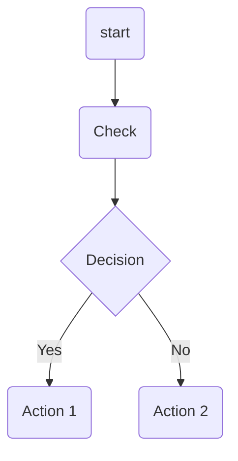
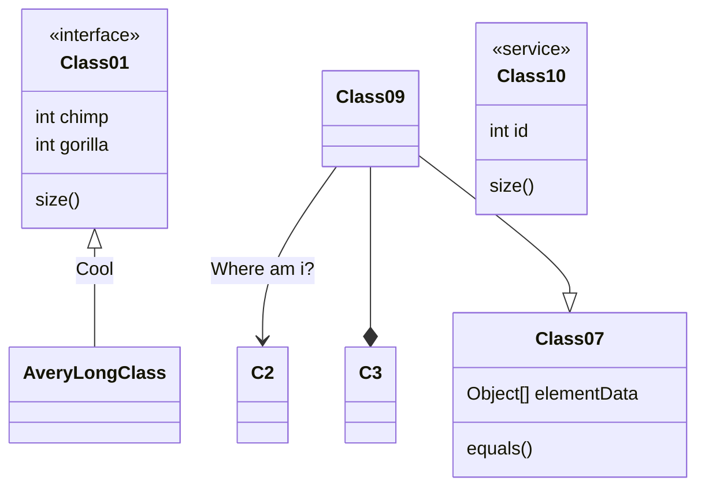
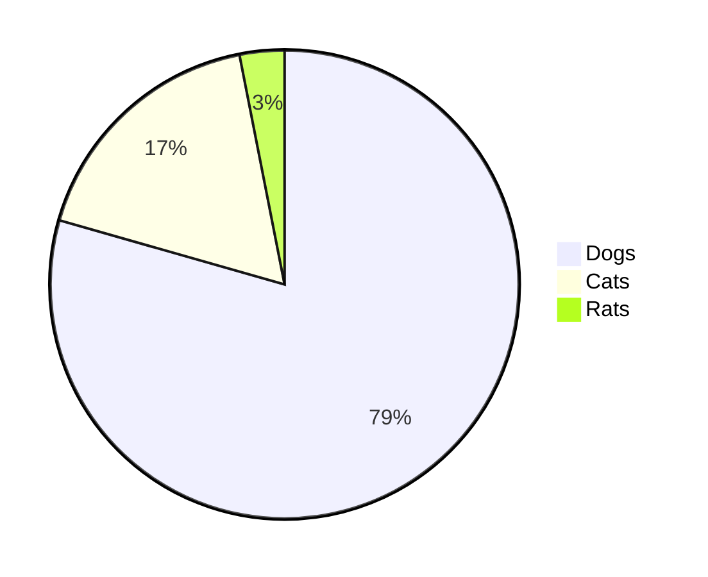

#Ruby on Rails documentation ✨📊✅🔺


<!-- @import "[TOC]" {cmd="toc" depthFrom=1 depthTo=6 orderedList=false} -->

<!-- code_chunk_output -->

- [Ruby on Rails documentation ✨📊✅🔺](#ruby-on-rails-documentation)
- [This is an H1](#this-is-an-h1)
  - [This is an H2](#this-is-an-h2)
          - [This is an H6](#this-is-an-h6)
- [hash mark](#hash-mark)
  - [Components](#components)
- [Design📌📚🔴🔺🔷](#design)
- [MathJax](#mathjax)
- [Graph](#graph)

<!-- /code_chunk_output -->

```bash
npm

```
This is an H1
=============


HEADERS
Es importante que al poners headers se ponga un espacio despues de # 

This is an H2
# This is an H1

## This is an H2

###### This is an H6


<ol>
<li>Bird</li>
<li>McHale</li>
<li>Parish</li>
</ol>
Text
<!-- blank line -->
----
<!-- blank line -->
Text

This is **bold** and this is _italic_.

This is ***bold and italic***.

<p>This is a normal paragraph:</p>

<pre><code>This is a code block.
</code></pre>
<p>Here is an example of AppleScript:</p>

<pre><code>tell application "Foo"
    beep
end tell
</code></pre>


<div class="footer">
        &copy; 2004 Foo Corporation
    </div>


>A simple text


> **_NOTE:_**  The note content
---
**NOTE**

It works with almost all markdown flavours (the below blank line matters).

---

\*literal asterisks\*

\   backslash
`   backtick
*   asterisk
_   underscore
{}  curly braces
[]  square brackets
()  parentheses
#   hash mark
+	plus sign
-	minus sign (hyphen)
.   dot
!   exclamation mark

<span style="color:green">some *blue* text</span>.
<span style="color:red">some *red* text</span>.

##Components
- Item1 **here**
- Item2 *here*


#Design📌📚🔴🔺🔷


Class diagram



#MathJax
$$\lambda = \frac {v}{f}$$

$$
\frac{n!}{k!(n-k)!} = \binom{n}{k}
$$
$$a^2 + b^2 = c^2$$

#Graph
```sequence
MCU-> Sensor: Start
MCU->Sensor: Slave address
Sensor -->MCU: Ack

```

```sequence {theme= "hand}
MCU-> Sensor: Start
MCU->Sensor: Slave address
Sensor -->MCU: Ack

